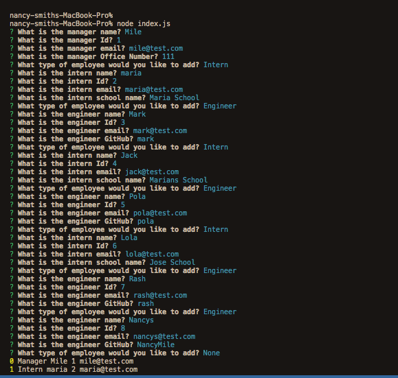
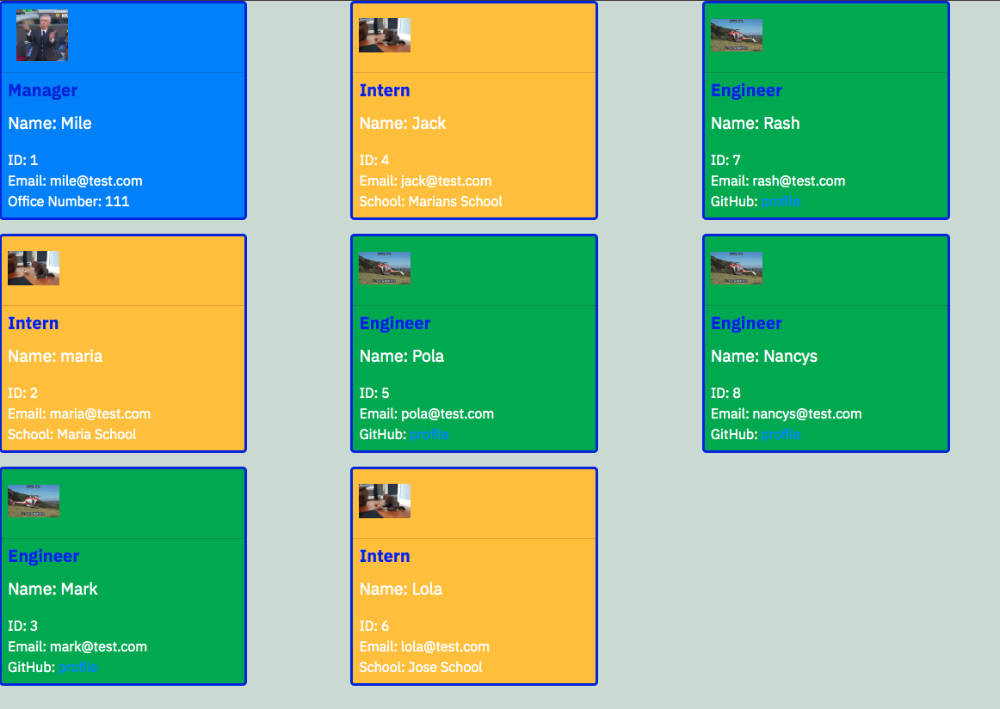

# team-profile-generator

Command-line application that takes in information about employees on a software engineering team, then generates an HTML webpage that displays summaries for each person.

## Functionality

```md
Command-line application that accepts user input
WHEN prompted for team members and their information
an HTML file is generated that displays a nicely formatted team roster based on user input
Click on an email address, the default email program opens and populates the TO field of the email with the address.
Click on the GitHub username the GitHub profile opens in a new tab
Start the application you will be prompted to enter the team manager’s name, employee ID, email address, and office number
Enter the team manager’s name, employee ID, email address, and office number
You will be presented with a menu with the option to add an engineer or an intern or to finish building the team
Depending on you selected option:
Select the engineer option you will be prompted to enter the engineer’s name, ID, email, and GitHub username, and I am taken back to the menu
Select the intern option you will be prompted to enter the intern’s name, ID, email, and school, and I am taken back to the menu
Once you have decided to finish building the team
The apllication will exit and the HTML will be generated
```

## Mock-Up

The following image shows a mock-up of the generated HTML’s appearance and functionality:





---
© 2022 Nancy S All Rights Reserved.
